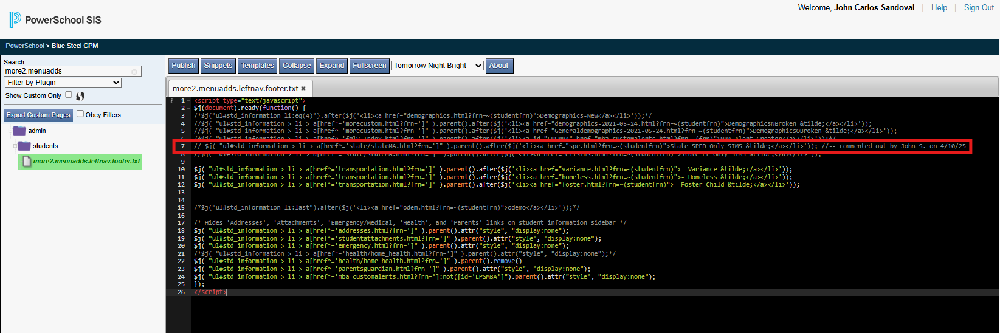
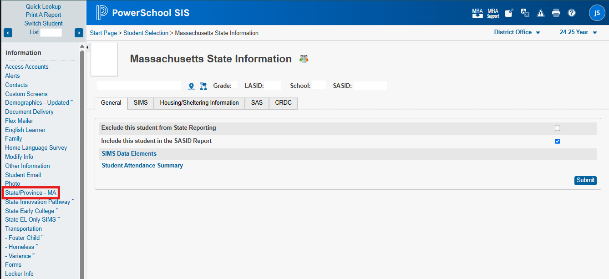
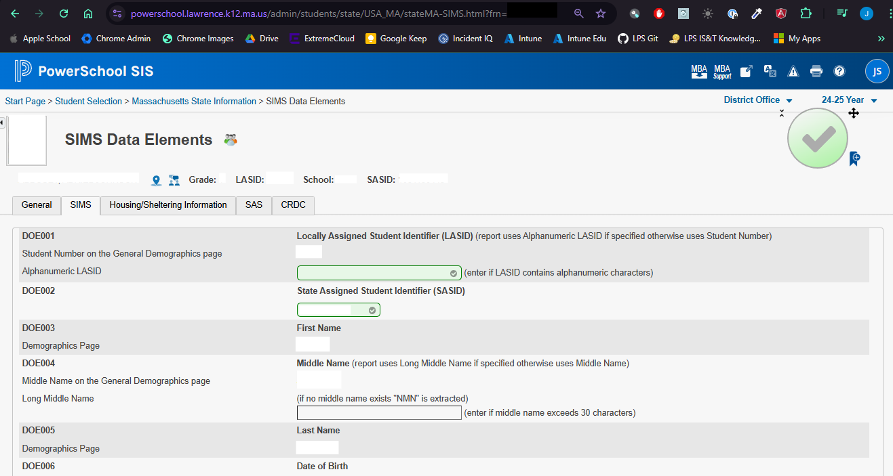
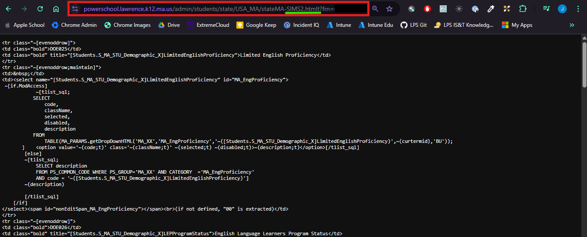

# LPS-SIMS-SPE Documentation

## Table of Contents
1. [Overview](#overview)
2. [Adding/ Replacing the Link](#adding-replacing-the-link)
3. [Adding a New DOE to the Page](#adding-a-new-doe-to-the-page)
   - [Steps to Add a New DOE](#steps-to-add-a-new-doe)
   - [Example Code for DOE039 - 504 Plan Status](#example-code-for-doe039---504-plan-status)

---

## Adding/ Replacing the Link
The original link to the **SPED Only SIMS~** page was disabled by commenting it out in the internal BlueSteel file: `more2.menuadds.leftnav.footer.txt`.



### New Link Implementation
A new file, `more2.LPS_SIMS_ELL.leftnav.footer.txt`, was created. This file uses JavaScript to dynamically insert the link to the **SPED Only SIMS~** page into the navigation bar.

```html
<script type="text/javascript">
  $j(document).ready(function () {
    $j("ul#std_information > li > a[href^='state/stateMA.html?frn=']")
      .parent()
      .after(
        $j(
          '<li><a href="lps_sims_spe.html?frn=~(studentfrn)">State SPED Only SIMS &tilde;</a></li>'
        )
      );
  });
</script>
```

---

## Adding a New DOE to the Page

### Steps to Add a New DOE
1. **Access the Source Page**:
   - Open the page in a new tab (due to iFrame properties).
   - Navigate to the **SIMS** tab on the page.

   
   

2. **Access the Raw PS Code**:
   - Insert a `t` after the `.html` in the URL to access the raw PS code and HTML.
   - If the file is too large, add a `2` after the file name (before `.html`).

   

3. **Copy and Paste the Code**:
   - Copy the relevant code from the source page.
   - Paste it into the new file.

---

### Example Code for DOE039 - 504 Plan Status
Below is the code snippet for adding **DOE039 - 504 Plan Status** to the page:

```html
<tr class="~[evenoddrow]">
  <td class="bold">DOE039</td>
  <td class="bold" title="[Students.S_MA_STU_SPED_X]Sec504PlanStatus">
    504 Plan Status
  </td>
</tr>
<tr class="~[evenoddrow;maintain]">
  <td>&nbsp;</td>
  <td>
    <select
      name="[Students.S_MA_STU_SPED_X]Sec504PlanStatus"
      id="MA_504PlanStatus"
    >
      ~[if.ModAccess]
      ~[tlist_sql;
        SELECT code, className, selected, disabled, description
        FROM TABLE(MA_PARAMS.getDropDownHTML(
          'MA_XX',
          'MA_504PlanStatus',
          '~([Students.S_MA_STU_SPED_X]Sec504PlanStatus)',
          ~(curtermid),
          'BU'
        ));
      ]
      <option
        value="~(code;t)"
        class="~(className;t)"
        ~(selected;t)
        ~(disabled;t)
      >
        ~(description;t)
      </option>
      [/tlist_sql]
      [else]
      ~[tlist_sql;
        SELECT description
        FROM PS_COMMON_CODE
        WHERE PS_GROUP='MA_XX'
          AND CATEGORY='MA_504PlanStatus'
          AND code='~([Students.S_MA_STU_SPED_X]Sec504PlanStatus)'
      ]
      ~(description)
      [/tlist_sql]
      [/if]
    </select>
    <span id="nonEditSpan_MA_504PlanStatus"></span>
    <br />(if not defined, "00" is extracted)
  </td>
</tr>
```